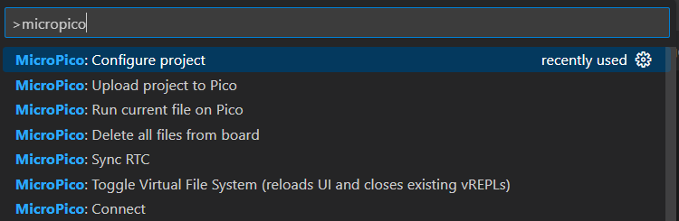

# Utiliser micropython sur RP2040 / Raspberry pi pico
## Installation de l'IDE
Ceci est un tutoriel pour l'utilisation de micropython sur microncontrôleur RP2040 / pico.\
Nous allons utiliser Thonny, un IDE simple et facile d'utilisation pour micropython.
* Télécharger Thonny : https://github.com/thonny/thonny (prendre la dernière release)
* Installez Thonny

### Setup du microcontrôleur RP2040
Nous allons maintenant préparer le microcontrôleur pour pouvoir éxécuter du code directement dessus.
* Télécharger le fichier uf2 présent dans ce repo ou sur le [site officiel](https://www.raspberrypi.com/documentation/microcontrollers/micropython.html)
* Brancher la pico en usb en maintenant le bouton **BOOT**. La pico devrait être reconnue en tant que stockage usb.
* Glisser le fichier uf2 dans cet espace de stockage usb.
L'espace de stockage usb généré par la pico devrait maintenant avoir disparu.

### Setup de l'IDE
Après avoir ouvert Thonny je vous conseille d'aller dans l'onglet **View** et de cliquer sur **Files** pour afficher l'arborescence de fichiers.\
Pour l'instant vous voyez seulement les fichiers de la racine utilisateur mais c'est normal cela servira par la suite.

Actuellement Thonny est configuré en tant qu'IDE classique donc vous pouvez écrire du code et il s'éxécutera mais pas sur votre microcontrôleur.
Pour utiliser votre pico, il faut la sélectionner comme interpréteur python dans Thonny.
* Cliquer sur **Local Python 3** dans le coin inférieur gauche de la fenêtre de l'IDE.
* Sélectionner l'interpréteur micropython.\

* Vous avez maintenant accès à votre pico via Thonny!

Il se peut que à ce moment là il y ait déjà un code pré-implanté dans la pico mais si ce n'est pas le cas :
* Clic droit sur la fenêtre d'arborescence à gauche
* Créez un nouveau fichier avec **New File** nommé "main.py" (le .py est essentiel pour préciser à Thonny quel type de fichier vous créez)
Vous pouvez désormais programmer avec micropython sur votre Rasberry pi pico !

### Blink
Vous pouvez retrouver un exemple de code permettant de faire clignoter la led rgb adressable du RP2040 zero dans ce repo.
## VSCode et MicroPico
Pour ceux qui voudraient utiliser VSCode pour leur programmation micropython, il existe des extensions qui le permettent.
Ici vous sera présenté l'extension MicroPico qui permet de développer en micropython sous VSCode.

* Installez l'extension MicroPico via le gestionnaire d'extensions VSCode.

* Ouvrez le dossier de votre projet avec **File > Open Folder**
* Appuyez sur CTRL+SHIFT+P puis rechercher la commande **"Configure Project"**

*
